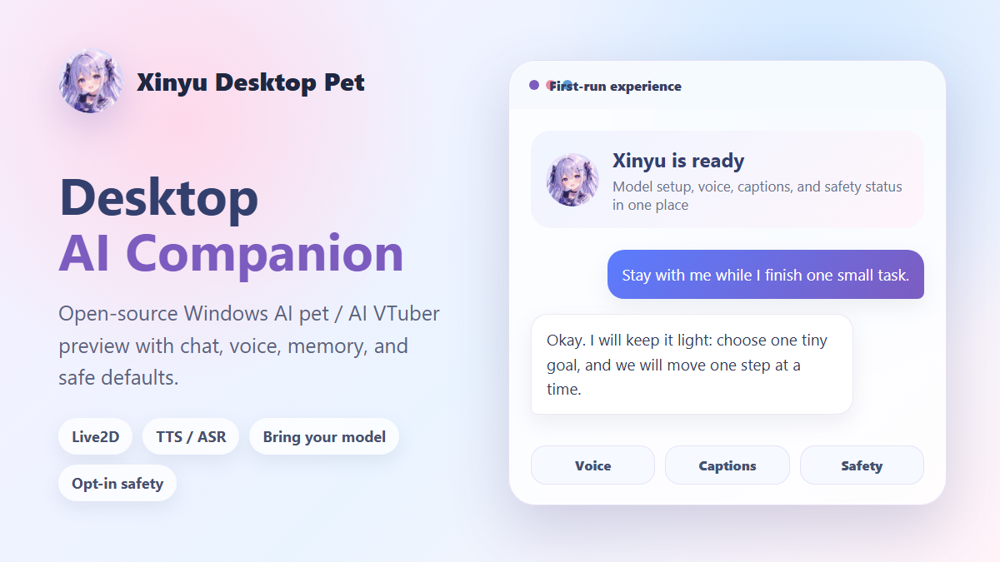

# 馨语桌宠 · Xinyu Desktop Pet

<p align="center">
  
</p>

<p align="center">
  <a href="https://github.com/MaQinglin-665/AI-chat/releases/tag/v1.4.0-preview.6"></a>
  
  
  
  
  <a href="LICENSE"></a>
</p>

**让 AI 以角色的方式陪在桌面上。**

馨语桌宠是面向 Windows 的开源 AI 桌面伙伴实验项目。你可以让 Live2D 角色待在桌面，用文字或语音交流；也可以进入 Galgame 模式，在场景、立绘与逐句台词中继续对话。

项目使用 Electron 与 Python 本地服务，支持用户配置的语言模型和语音服务。它仍处于 **MVP / 预览阶段**：响应速度、语音质量与角色表现依赖所用模型、服务和素材，不承诺全天候自主陪伴或完美的情绪理解。

English: An experimental Windows AI companion with Live2D and visual-novel dialogue, speech, editable memory, and optional context-aware interaction. Bring your own model and voice services.

[下载安装](#直接下载) · [首次配置](docs/first-install.md) · [模型选择](docs/model-selection.md) · [项目网站](https://maqinglin-665.github.io/AI-chat/) · [反馈问题](https://github.com/MaQinglin-665/AI-chat/issues)

## 两种陪伴方式

| 桌面 Live2D | Galgame 对话 |
| --- | --- |
| 透明桌面窗口、语音与情绪动作反馈 | 场景背景、透明立绘、逐句台词 |
| 本地时间场景与可选的低打扰主动回应 | 自由输入、逐字显示、逐句朗读、手动推进 |
| 长期记忆可查看、编辑、固定和删除 | 切换人物时淡出至黑屏，载入后重新亮起 |

<p align="center">
  
  
  
</p>
<p align="center"><sub>项目中的非官方角色立绘示例；实际可选表情以现有素材为准。</sub></p>

Galgame 当前提供三种角色风格：DeepSeek 阳光活泼，Claude 典雅从容，GPT 果断能干。模型会为每句回复选择已有的表情、动作和场景；未来计划、假设或引用不应被当作已经发生的换景。手动选择背景后可以锁定，也可以恢复自动判断。

> 这些是项目中的角色扮演设定与非官方拟人形象，不代表相关公司的官方角色。GPT、Claude 的现有立绘只有日常、开心、思考几类，其他情绪会使用可用素材保底。

## 本轮源码更新

- **对话与表演同步**：逐句生成、打字机显示和朗读；跳句、退出或换人会取消旧播放。Galgame 使用独立的结构化输出预算，避免普通短回复限制截断动作信息。
- **更自然的交流**：调整角色说话风格，增加结合当前对话状态决定回应或等待的可选交互逻辑。
- **可管理的长期记忆**：创建、编辑、固定与删除记忆，查看待整理内容；修正后续检索仍命中被删除内容的问题。
- **场景与界面**：晨间、白天、黄昏、夜间场景选择，舞台动效和控制中心整理。
- **桌面上下文边界**：加强密码、登录等敏感界面的上下文过滤；桌面感知仍需显式开启，过滤并不等同于保证识别所有敏感内容。

上述内容描述本更新分支的源码，**不表示历史安装包已包含这些功能**。最近发布的安装包仍为 [v1.4.0-preview.6](https://github.com/MaQinglin-665/AI-chat/releases/tag/v1.4.0-preview.6)；本轮没有创建新安装包或新版本标签。

模型实测与限制见 [Galgame 验收记录](docs/galgame-live-acceptance.md)，本轮变更范围见 [源码更新说明](docs/source-update-2026-09.md)。

## 直接下载

如果你只是想试用，不需要先访问项目网站，直接打开 GitHub Release：

[下载 v1.4.0-preview.6](https://github.com/MaQinglin-665/AI-chat/releases/tag/v1.4.0-preview.6)

普通 Windows 用户优先下载这 3 个文件：

```text
Xinyu-AI-Desktop-Pet-Setup-v1.4.0-preview.6.exe
SHA256SUMS.txt
RELEASE-ASSETS.md
```

`RELEASE-ASSETS.md` 会说明每个文件的用途、大小和 SHA256；`SHA256SUMS.txt` 用来校验安装器。项目不内置云模型、托管 endpoint 或 API key，首次启动后需要在应用内配置自己的模型。

48 秒 demo 视频：[docs/assets/demo-overview.mp4](docs/assets/demo-overview.mp4)

## 适合谁

- 想体验 Windows 桌面 AI 伙伴 / Live2D AI VTuber 原型的人。
- 想研究 Electron 桌面 UI、Python 本地服务、LLM、TTS/ASR、Live2D 串联方式的开发者。
- 愿意接受预览版限制，并反馈首跑、模型兼容、语音链路、角色体验问题的早期测试者。

## 数据与服务

- 模型支持 OpenAI-compatible、OpenAI、Ollama 等配置方式，仓库不附带 API Key 或托管模型。
- 语音支持 TTS / ASR；不同提供商的环境要求与效果不同。首次配置可参考 [安装指南](docs/first-install.md)。
- 配置、记忆与本地服务运行在你的电脑上；使用云端模型或语音服务时，相应请求会发送到你配置的服务，并非所有处理都离线完成。
- 桌面感知与工具能力均为可选项；只在了解数据去向与权限后启用。

## 快速开始

### 1. 普通 Windows 用户下载安装器

在 release 页面优先下载：

```text
Xinyu-AI-Desktop-Pet-Setup-v1.4.0-preview.6.exe
SHA256SUMS.txt
RELEASE-ASSETS.md
```

安装器会把项目文件复制到当前用户目录，创建开始菜单 / 桌面快捷方式，并启动 `install_and_start.bat` 完成首跑引导。它不会内置云模型、不会写入 API key、不会开启桌面观察、工具调用或 shell。

首发安装器未签名。运行前建议先校验 SHA256：

```powershell
Get-FileHash .\Xinyu-AI-Desktop-Pet-Setup-v1.4.0-preview.6.exe -Algorithm SHA256
Get-Content .\SHA256SUMS.txt
```

如果 Windows SmartScreen 提醒未知发布者，只有在文件来自本仓库 release 且 SHA256 匹配时才继续。不要为了运行预览包关闭系统安全设置。

`RELEASE-ASSETS.md` 会列出每个发布文件的用途、大小和 SHA256，便于普通用户判断该下载哪个文件。

### 2. 开发者使用源码包

需要看源码或参与开发时，下载 release 里的源码测试包：

```text
Xinyu-AI-Desktop-Pet-v1.4.0-preview.6-windows-source-test.zip
```

解压后确认根目录至少包含：

```text
electron/
scripts/
tests/
web/
package.json
requirements.txt
requirements-dev.txt
```

如果缺少 `web/`、`electron/` 或 `tests/`，说明下载的不是完整当前源码，请重新下载。GitHub 自动生成的 `Source code` 压缩包只是仓库快照，不等同于经过首跑检查的源码测试包。

也可以使用当前 `main` 分支源码：

```powershell
git clone https://github.com/MaQinglin-665/AI-chat.git
cd AI-chat
```

### 3. 引导式一键入口

第一次体验优先双击：

```text
install_and_start.bat
```

或在 PowerShell 中运行：

```powershell
.\install_and_start.bat
```

它会尽量串起完整首跑路径：

1. 检查 Python / Node.js / npm，必要时提示使用 winget 安装。
2. 创建 `.venv` 并安装 Python 依赖。
3. 安装 Electron / Node 依赖。
4. 初始化 `config.json` 和 `.env`。
5. 应用当前预览体验配置。
6. 启动 Electron 桌宠。
7. 在应用内首次配置向导里填写 provider / base URL / model / API key。

你仍需要提供自己的模型和 API key。首句 smoke check 已改为高级排查步骤，不再阻塞普通用户首次启动。

### 4. 应用内首次配置向导

首次启动或 LLM 配置不完整时，聊天窗口会显示模型配置向导。字段固定为：

- provider 类型
- base URL
- model
- API key env 名称
- API key

默认 provider 是 `openai-compatible`，默认 env 名称是 `TAFFY_LLM_API_KEY`。保存时，非密钥配置写入 `config.local.json`，真实 key 写入 `.env`，随后自动调用 `/api/llm_probe` 显示成功或可读失败原因。

### 5. 分步首跑路径

如果你更想逐步排查，使用下面的流程：

```powershell
.\prepare_preview_environment.bat
powershell -NoProfile -ExecutionPolicy Bypass -File scripts\configure-llm.ps1
powershell -NoProfile -ExecutionPolicy Bypass -File scripts\diagnose-llm-link.ps1 -SoftFail
powershell -NoProfile -ExecutionPolicy Bypass -File scripts\first_chat_smoke.ps1
.\start_electron.bat
```

`prepare_preview_environment.bat` 会准备依赖、初始化本地配置，并应用预览体验配置：支持中文或英文输入、默认自然英文回复、在身份和能力边界相关时坦诚说明自己是 AI，同时保留安全默认值。

`configure-llm.ps1` 会把 provider / base URL / model 写入 `config.local.json`，把 API key 写入 `.env`，不会把真实 Key 写进 JSON 配置。

`first_chat_smoke.ps1` 会检查后端健康状态，并发送一条轻量聊天请求。想避免真实聊天请求时可加 `-SkipChat` 或 `-SkipLlmProbe`。

### 6. 只安装依赖

如果只想做低层依赖 bootstrap，不应用预览配置：

```powershell
.\install_first_run.bat
```

## 常用命令

开发者本地验证：

```powershell
powershell -ExecutionPolicy Bypass -File scripts\doctor.ps1
powershell -ExecutionPolicy Bypass -File scripts\setup-dev.ps1
powershell -ExecutionPolicy Bypass -File scripts\test-local.ps1
python scripts\first_run_check.py
node scripts/run_node_tests.js
```

清理本地 ignored 运行产物：

```powershell
powershell -NoProfile -ExecutionPolicy Bypass -File scripts\clean-local-artifacts.ps1
```

默认只预览要清理的内容，需要真正删除时加 `-Apply`。本地配置、依赖目录、dist 和 memory 需要额外显式开关才会纳入清理范围。

## 项目结构

```text
electron/      Electron 桌面窗口与进程管理
web/           前端 UI、Live2D 渲染、聊天与配置页面
scripts/       首跑、诊断、测试、打包脚本
docs/          安装、配置、路线图、GitHub Pages 文档站
tests/         Python / Node / 前端行为测试
app.py         Python 本地服务入口
config.py      配置加载与安全默认值
```

## 配置入口

- 首次安装：[docs/first-install.md](docs/first-install.md)
- 安装与运行：[docs/setup.md](docs/setup.md)
- 模型选择：[docs/model-selection.md](docs/model-selection.md)
- 推荐本地配置：[docs/recommended-local-config.md](docs/recommended-local-config.md)
- Live2D / Character Runtime：[docs/character-runtime-live2d-mapping.md](docs/character-runtime-live2d-mapping.md)
- 语音输入 / 输出排障：[docs/voice-troubleshooting.md](docs/voice-troubleshooting.md)
- 常见问题与排障：[docs/troubleshooting.md](docs/troubleshooting.md)
- 后端健康接口：[docs/backend-health.md](docs/backend-health.md)
- 可视化配置中心：[docs/config.html](docs/config.html)

后端启动后可以访问：

- `http://127.0.0.1:8123/healthz`：轻量公开探活
- `http://127.0.0.1:8123/api/health`：详细自检，包含 LLM / TTS / ASR / Live2D / 安全配置摘要

如果启用了 `server.require_api_token`，访问 `/api/health` 需要带 `X-Taffy-Token`。

## 安全默认值

默认建议保持：

- `observe.attach_mode=manual`
- `tools.enabled=false`
- `tools.allow_shell=false`

首次安装脚本不会默认开启桌面观察、截图、用户文件读取、工具调用或 shell 执行。不要把真实 API Key / Token 提交到仓库。

## 首跑成功后怎么反馈

如果已经能打开桌宠并完成一次聊天，下一步最有价值的反馈是：启动耗时、模型响应速度、语音是否稳定、Live2D 动作是否自然、角色语气是否像“馨语”而不是通用助手。

建议使用 [docs/first-run-feedback.md](docs/first-run-feedback.md) 记录测试结果。公开反馈前请移除 API key、token、原始 prompt、raw history、私有本地路径和私密截图。

## 第三方资源

仓库中包含用于预览和本地运行的第三方 runtime、Live2D sample model、demo 媒体和项目素材。项目代码的 MIT License 不会自动覆盖这些资源；重新分发、二次打包或替换素材前，请先看 [THIRD_PARTY_NOTICES.md](THIRD_PARTY_NOTICES.md)。

## 路线图

- `v1.2` First Run & Stability
- `v1.3` Character Runtime
- `v1.4` AI VTuber Feeling
- `v1.5` Desktop Awareness
- `v2.0` Productized Release

详细计划见 [docs/ROADMAP.md](docs/ROADMAP.md)。路线图是当前执行方向，不代表所有能力已经成熟可用。

## 参与贡献

- 贡献指南：[CONTRIBUTING.md](CONTRIBUTING.md)
- 更新日志：[CHANGELOG.md](CHANGELOG.md)
- 安全策略：[SECURITY.md](SECURITY.md)
- License：[LICENSE](LICENSE)

反馈首跑问题时，建议使用 GitHub issue 的 `First-Run Help` 模板，并移除 API key、token、原始 prompt、raw history、私有本地路径和私密截图。
